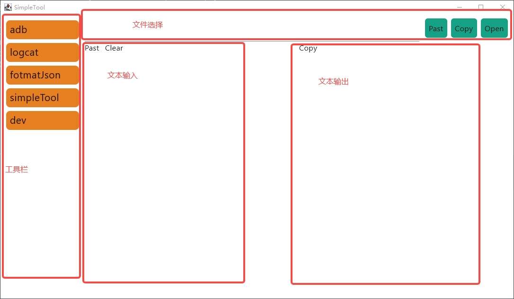

# 小工具

## 项目简介

这是一个基于compose desktop的小工具，
可以方便的封装一些常用的工具，重复的操作，让日常开发更方便。

## ui

## 现有功能

### adb 辅助
+ 打开小爱调试页面 `TestActivity`
+ 打开scrcpy投屏 `scrcpy`
+ 安装apk `install`
  + 默认安装选中的文件
  + 安装下载目录最新apk文件
  + 安装build目录最新apk文件
  + 安装ci指定分支最新产物

### 抓取log
+ 存储在指定目录下，文件名递增
+ 抓取结束后，可以快速在文件编辑器中打开

### 格式化json
+ 文本输入
+ 展开多层嵌套的json（json string字段为json）
+ 在 vscode 中打开

### 小工具
+ dump android 设备上指定进程的内存，并转换格式
+ search text 在zip包中搜索指定正则的文本，用于在bugreport中快速找到log文件
+ link log。连接过长，分多行打印的log

## 如何添加新功能
1. 借助辅助函数`createCommand` `createSimpleCommand` 创建新的指令
    > createCommand 是有输出的指令， createSimpleCommand是无输出的指令
    
    > 指令的输入是Request对象，包含输入的文本内容和输入文件
    
    > 指令的输出是Flow String对象

    > 可以通过 `onExit` `clearExitHook` 来执行在指令退出时需要清除的资源

2. `createCommand` 中借助 `subCommand` `simpleSubCommand` 添加子指令

    > `subCommand` 是有输出的字命令， `simpleSubCommand` 是无输出的子命令

    > `subCommand`, `simpleSubCommand` 是添加子命令，可以通过 `deleteSubCommand` 删除子命令，`clearSubCommand`清除所有子命令

3. `tool/Control.kt` 中的 enum `Command` 添加新的值
4. `tool/Control.kt` 中的 `handleInput` 添加路由到第一步创建的指令
5. 重新编译运行项目